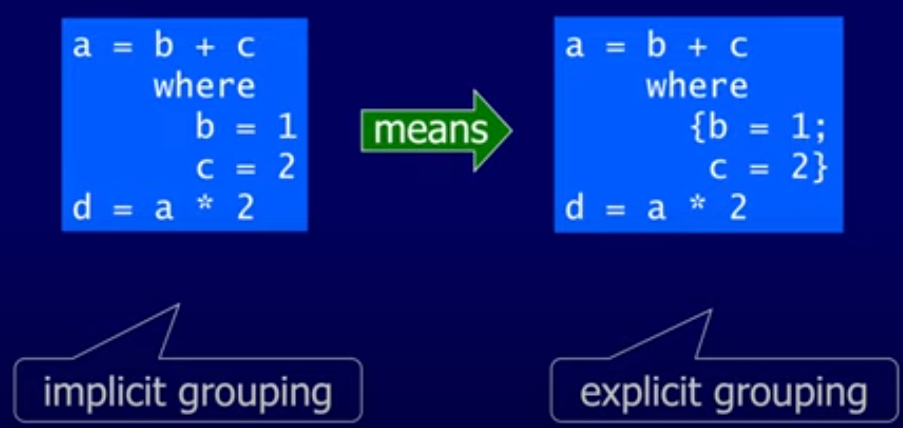

# Notes

I'm taking these notes while watching [this playlist](https://www.youtube.com/playlist?list=PLF1Z-APd9zK7usPMx3LGMZEHrECUGodd3)

## The Prelude

The Prelude is a Haskell standard library which contains basic things to make life easy. The full list of features is available at https://hackage.haskell.org/package/base-4.17.0.0/docs/Prelude.html

- `tail []` gets the last element from a list
- `[] !! n` gets the nth element from the list []
  - List indexes start at zero, just a reminder
- `take n []` returns the first n elements from a list
- `drop n []` removes the first n elements from a list
- `length []` is self-explanatory
- `sum []` is also self-explanatory
  - The sum of an empty list returns 0 (because of an identity function)
- `product []` is, too, self-explanatory
  - The product of an empty list returns 1
- `[] ++ []` appends two lists
- `reverse []`, unsurprisingly, reverts a list
- `init []` returns the same list without the last element (`init`ial segment)

## Useful GHCi Commands

> Note: GHCi is the interpreter version of GHC, the standard version being a compiler

> Note 2: All commands below can be abbrevated using their first letter (such as `:quit` which can be simply `:q`)

    :load scriptname

Load a particular script file with scriptname

    :reload

Reloads the current scripts being used

    :edit name

Uses the default editor set in GHCi to edit the specified file

    :set editor name

Sets the default editor in GHCi (for example, `:set editor vim`)

    :edit

Edits the file passed as a parameter to the `ghci` command when you first ran the interpreter

    :type expr

Shows the type of an expression

    :?

Displays all GHCi commands.

    :quit

Quits GHCi _(bonus points for being the same as vi)_

## Styling Haskell

### Naming

- Functions and argument names must begin with a lowercase letter (much like the german language)
- If a list is being passed as an argument, it is referred with the suffix `ns`

### Layout Rule

- In a sequence of definitions, each definition must begin in the same column
  - That is to say, don't get fancy with indents that don't make too much sense

This rule makes so we can keep grouped definitions implicit, such as in the image below:

