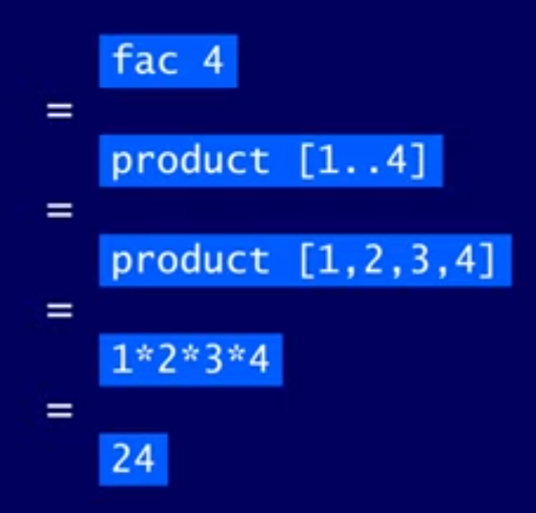
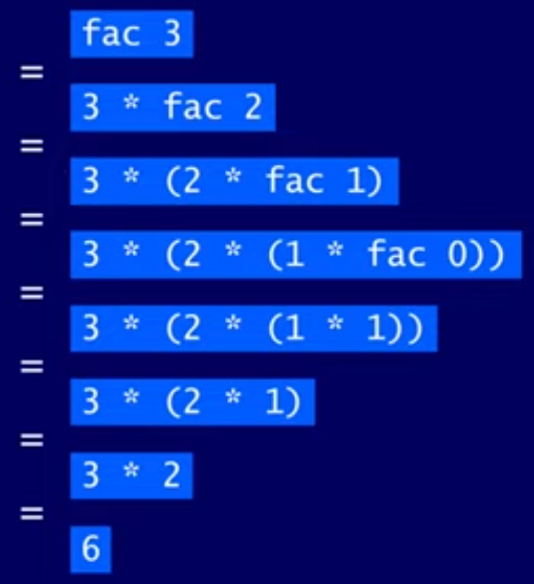

# Lesson 5 - Recursive Functions

- Many functions can be defined in terms of other functions

> Bonus: See [The Evolution of a Haskell Programmer](http://www.willamette.edu/~fruehr/haskell/evolution.html) for a lot of ways to create a factorial function

- Expressions are evaluated by a stepwise process of applying functions to their arguments:



Functions can also be defined in terms of themselves. Such functions are called **recursive**.

```haskell
fac 0 = 1
fac n = n * fac (n-1)
```

- The first equation is the base case, which stops the recursion
- The second equation is the recursive case, which uses itself in its definition

> When defining a recursive function for non-negative numbers, the usual patterns for cases are for 0 and `n`



- We define the base case as returning 1 because 1 is the identity for multiplication (1*x = x)
- This recursive definition diverges on negative integers because the base case is never reached

## Why is Recursion Useful?

- Some functions are very simple to define in terms of other functions
- However, many functions can naturally be defined in terms of themselves
- When making recursive functions, you can use induction to prove their properties

## Recursion on Lists

```haskell
product :: Num a => [a] -> [a]
product [] = 1
product (n:ns) = n * product ns
```

- The usual cases for working with lists are the empty list case and the non-empty list case

## Recursion with Multiple Arguments

Functions with more than one argument can also be defined using recursion. For example:

```haskell
zip :: [a] -> [b] -> [(a,b)]
zip [] _ = []
zip _ [] = []
zip (x:xs) (y:ys) = (x,y) : zip xs ys
```

### Turning the Handle in `drop`

Here's the definition of the `drop` function, which drops `n` elements of a list:

```haskell
drop :: Int -> [a] -> [a]
drop 0 xs = xs
drop _ [] = []
drop n (_:xs) = drop (n-1) xs
```

Let's try "turning the handle" on it to understand how it works:

```haskell
drop 3 [1,2,3,4,5]
drop 2 [2,3,4,5]
drop 1 [3,4,5]
drop 0 [4,5]
[4,5]
```

## Quicksort

The quicksort algorithm for sorting a list of values can be specified by the following two rules:

- An empty list is sorted
- A non-empty list can be sorted by sorting the tail values lower or equal to the head, sorting the tail values greater than the head and then appending the resulting lists on either side of the head value
- See [quicksort.hs](../quicksort.hs) for the implementation in Haskell
  - This definition drives the point home that recursion can be thought of as a way to **divide and conquer** complex problems

## Thinking Recursively

1. Figure out the base cases for the function
   1. If you receive something that's too general you can just not make a base case for it