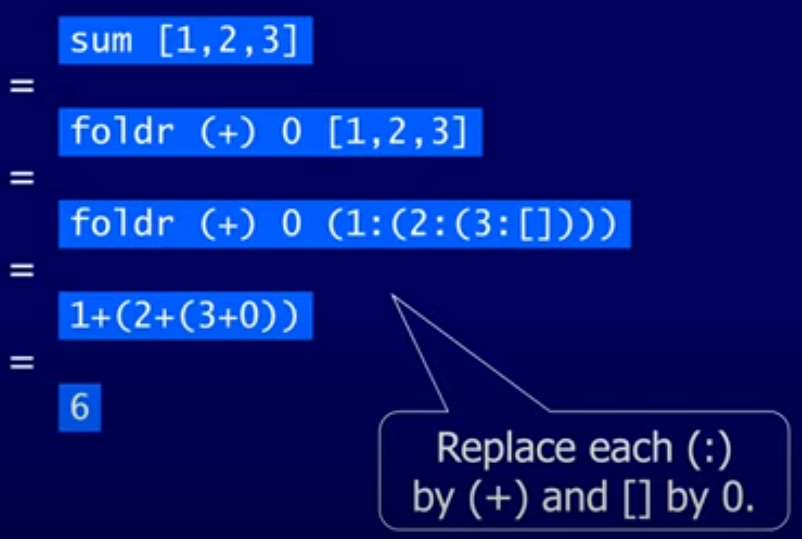

# Lesson 6 - Higher Order Functions

A function is *higher-order* if it either takes a function as a parameters or returns a function as a result:

```haskell
twice :: (a -> a) -> a -> a
twice f x = f (f x)
```

## Why Are Higher Order Functions Useful?

- Common programming idioms can be encoded as functions within the language itself
  - Applying a function twice becomes calling the twice function passing the function you want to apply twice as a parameter
- Domain specific languages can be defined as collections of higher order functions
  - Haskell libraries are often defined like this
- Higher order functions has algebraic properties that can be used to reason about programs
  - Reasoning about programs is useful to go after efficiency

## The `map` Function

- Applies a function to every element of a list

```haskell
map : (a -> b) -> [a] -> [b]
map f xs = [f x | x <- xs]
```

- Basically a list comprehension, if you think of it as returning the functin being applied to each item in the list
  - When thinking about loops it's easier to comparing `foreach` than pure `for` loops

## The `filter` Function

- Receives a function and a list and returns the elements of a list that satisfy the function

```haskell
filter :: (a -> Bool) -> [a] -> [a]
filter p xs = [x | x <= xs, p x]
```

- This can also be defined recursively:

```haskell
filter p [] = []
filter p (x:xs)
    | p x       = x : filter p xs
    | otherwise =  filter p xs
```

- In the recursive definition, it always calls itself, but it can either only call itself if `x` doesn't satisfy the function `p` or if it does, `x` is included in the return chain

## The `foldr` Function

- A bit more abstract, but more powerful
- There is a common pattern of recursion that some functions follow:
  
```haskell
f [] = <identity>
f (x:xs) = x <operator> f xs
```

- This is just a pattern, not a function definition
- The name of this pattern is primitive recursion
- `foldr` (Fold Right) takes the operator for the recursive case and the value for the base case and returns a recursive function that's defined following the pattern
- It's best to think of `foldr` non-recursively as it doing two things:
  - Replacing each (:) in a list by a function
  - Replacing the [] in the extended definition



### Why is Foldr Useful?

- Some recursive functions on lists, such as sum, are simpler to define using `foldr`
- Properties of functions defined using `foldr` can be proved using algebraic properties of `folder` (fusion, banana split)
- Advanced program optimisations can be simples if `foldr` is used in place of explicit recursion

## Other Library Functions

- The function `(.)` returns the composition of two functiosn as a single function:

```haskell
odd :: Int -> Bool
odd = not . even
```

Beautiful.

- `all` decides if every element of the list satisfies a given filter

```haskell
> all even [2,4,6,8,10]
True
```

- There's the `any` function that does the same but will return True even if only 1 element satisfies the property

- `takeWhile` selects elements from a list and only stops if a filter returns false
- `dropWhile` does the opposite, it keeps removing elements of the list until the filter returns false
  - Useful for trimming strings